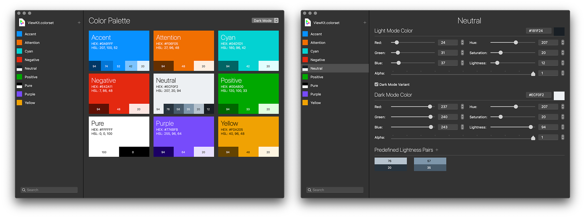

ColorSet
========

  

About
-----

**`ColorSet` is a macOS utility and framework allowing developers to manage custom interface colors with ease.**

### Rationale

As of macOS 10.14 Mojave, Apple introduced a system-wide dark-mode.  
Applications linked with the macOS 10.14 SDK now need to react to system appearance changes.

While built-in AppKit UI elements handle this perfectly, an application often relies on custom controls, custom drawing code, or at last custom colors.

As an example, the following code will perfectly react to the dark mode.  
This is a system color, so everything is handled automatically by AppKit:

    let color = NSColor.textColor

While the following won't change, as the color components are hard-coded:

     let color = NSColor( deviceRed: 1, green: 0, blue: 0, alpha: 1 )
     
Apple provides a nice solution, relying on Asset Catalog files.  
As of Xcode 10, you can create custom colors in Asset Catalogs, identified by a name, and optionally containing variants for a specific UI theme or device.

**Unfortunately, this feature is only available for applications running on macOS 10.13 and later.**  
It basically means you'll have to drop support for macOS 10.12 and below.

If you need to support macOS 10.12 or below, **Apple's official recommendation (as seen during WWDC18) is to actually hard-code colors using conditional platform-detection code**.

**So here comes `ColorSet`.**

### ColorSet & ColorSetKit

`ColorSet` is both a macOS application and a macOS Swift framework, `ColorSetKit`.

The application lets you create files containing colors and variants, just as an Asset Catalog File, while the framework allows you, in your application, to retrieve colors from the `.colorset` file using names, just like the macOS 10.13 SDK.

### Creating a `.colorset` file

The application lets you create as many colors as you want, each with a unique name.  
For each color, an optional dark variant can be set:

### Using ColorSetKit

By default, `ColorSetKit` will look for a file named `Colors.colorset` in your application's bundle.

Colors can be retrieved using a custom method on `NSColor`:

    let color = NSColor.colorFromColorSet( "MyCustomColor" )

By themselves, colors won't react to UI theme changes.  
But the `colorFromColorSet` method will return the correct color, based on the current UI theme.

This means that if you use custom drawing code, you shouldn't cache color objects, but instead call `colorFromColorSet` directly from your drawing code.  
This way, the correct color will be used each time your view is redrawn (which happens automatically when the UI theme changes).

License
-------

**`ColorSet` is released under the terms of the MIT license.**

Repository Infos
----------------

    Owner:   DigiDNA
    Web:     www.digidna.net
    Blog:    imazing.com/blog
    Twitter: @DigiDNA
    GitHub:  github.com/DigiDNA
